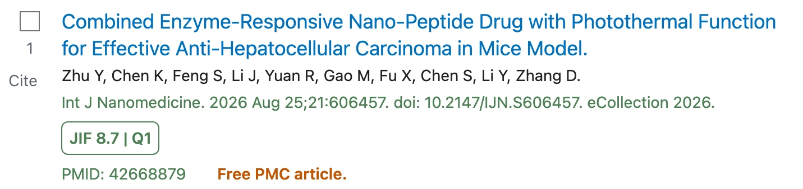

# PubMetrics

PubMetrics is a lightweight userscript that displays Journal Impact Factor (JIF) and JCR quartile information directly in PubMed.

It works on both search result pages and individual article pages.

## Features

- Shows JIF and JCR quartiles in PubMed search results
- Shows metrics beside the journal name on article pages
- Preserves all JCR categories and quartiles
- Shows category details on hover
- Supports dynamically loaded results such as "Show more"
- Uses PubMed/NLM journal abbreviations for direct matching
- Uses a compact local JSON database

## Screenshots

### Search results



### Article page


## Repository Structure

```text
PubMetrics/
├── build_database.py
├── userscript/
│   └── main.user.js
├── data/
│   ├── journals.json
│   ├── pubmed_metrics.json
│   ├── unmatched.json
│   └── ambiguous.json
├── jcr/
│   └── *.csv
├── assets/
│   ├── search-results.png
│   └── article-page.png
├── requirements.txt
├── .gitignore
├── LICENSE
└── README.md
```

## Database Builder

`build_database.py`:

1. reads JCR CSV files from `jcr/`
2. merges journals using ISSN/eISSN
3. preserves distinct categories and quartiles
4. queries the NCBI NLM Catalog
5. retrieves `MedlineTA` and NLM IDs
6. builds the full and compact databases
7. writes unmatched and ambiguous records

## Data Files

### `data/journals.json`

Full journal database with JCR and NLM metadata.

Example:

```json
{
  "1471-0072": {
    "name": "NATURE REVIEWS MOLECULAR CELL BIOLOGY",
    "jcr_abbreviation": "NAT REV MOL CELL BIO",
    "pubmed_abbreviation": "Nat Rev Mol Cell Biol",
    "nlm_id": "100962782",
    "issn": "1471-0072",
    "eissn": "1471-0080",
    "jcr_year": 2025,
    "jif": "118",
    "categories": [
      {
        "name": "CELL BIOLOGY",
        "quartile": "Q1"
      }
    ]
  }
}
```

### `data/pubmed_metrics.json`

Compact runtime database used by the userscript.

It is indexed directly by PubMed abbreviation:

```json
{
  "Clin Pharmacokinet": {
    "jif": "4.0",
    "jcr_year": 2025,
    "categories": [
      {
        "name": "PHARMACOLOGY & PHARMACY",
        "quartile": "Q2"
      }
    ]
  }
}
```

### `data/unmatched.json`

JCR journals that could not be matched to NLM using ISSN/eISSN.

### `data/ambiguous.json`

Journals with multiple equally plausible NLM matches.

## Setup

Python 3 is required.

```bash
python3 -m venv .venv
source .venv/bin/activate
python -m pip install -r requirements.txt
```

Current dependency:

```text
requests>=2.32,<3
```

## Building the Database

Place JCR CSV exports in:

```text
jcr/
```

Expected columns include:

```text
Journal name
JCR Abbreviation
ISSN
eISSN
Category
2025 JIF
JIF Quartile
```

Set your email in `build_database.py`:

```python
EMAIL = "your-email@example.com"
```

Then run:

```bash
python build_database.py
```

Generated files:

```text
data/journals.json
data/pubmed_metrics.json
data/unmatched.json
data/ambiguous.json
```

## Matching

The builder merges journals using both ISSN and eISSN.

It then queries the NCBI NLM Catalog and retrieves:

- NLM Unique ID
- PubMed abbreviation (`MedlineTA`)
- valid print ISSN
- valid electronic ISSN

The PubMed abbreviation becomes the key in `pubmed_metrics.json`, allowing direct lookup in the userscript.

Different JCR categories are preserved even when they share the same quartile:

```text
PHARMACOLOGY & PHARMACY: Q1
TOXICOLOGY: Q1
```

which is displayed as:

```text
Q1/Q1
```

## Installing the Userscript

Install a userscript manager such as:

- Violentmonkey
- Tampermonkey

Then install or copy the PubMetrics userscript.

It runs on:

```text
https://pubmed.ncbi.nlm.nih.gov/*
```

and loads:

```text
data/pubmed_metrics.json
```

## PubMed Search Results

The script extracts the journal abbreviation from each PubMed citation and performs a direct lookup.

Example:

```text
Clin Pharmacokinet. 2025 Aug;64(8):...

JIF 4.0 | Q2
```

Hovering over the badge shows the full JCR category information.

A `MutationObserver` also processes results loaded through PubMed's "Show more" button.

## Individual Article Pages

On article pages, the badge is inserted beside the journal name.

Example:

```text
J Pharmacokinet Pharmacodyn  [JIF 3.3 | Q2]
```

The same hover tooltip is available.

## Updating the Database

For a new JCR release:

1. replace the CSV files in `jcr/`
2. update the JCR year or column name if needed
3. run:

```bash
python build_database.py
```

4. commit the updated files in `data/`

## Data Sources

Journal metrics are derived from Journal Citation Reports exports.

Journal identifiers and PubMed abbreviations are enriched through the NCBI NLM Catalog using NCBI E-utilities.

Raw JCR export files are not redistributed.

## License

The source code is licensed under the MIT License.

Generated data may include information derived from third-party sources, including Clarivate JCR and the NCBI/NLM Catalog, and remains subject to the applicable terms of those providers.